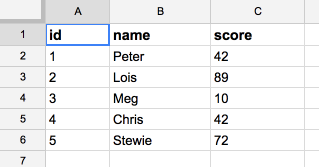
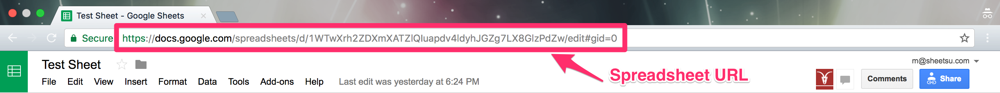
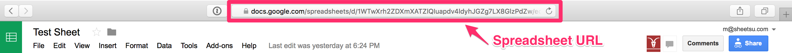

# Introduction
<a href="//github.com/sheetsu/docs/tree/master/source/includes/_introduction.md" target="_blank" class="gh-button"><i class="fa fa-github"></i> Edit on GitHub</a>

# Welcome

You can view code examples in the area on the right. You can switch the programming language with the tabs in the top right. We provide examples in cURL, Ruby and some of them with our Snippet - which is pure HTML.

Follow <a href="https://twitter.com/sheetsuhq" target="_blank">@sheetsuhq</a> on Twitter for latest updates and news.

# SDKs & Client libraries
Official libraries for the Sheetsu API are available in Ruby.

* Ruby: [https://github.com/sheetsu/sheetsu-ruby](https://github.com/sheetsu/sheetsu-ruby)

# How to prepare spreadsheet

Every spreadsheet should have the first row populated with column names. There are no mandatory fields or values you _need_ to have in your spreadsheet. The structure of the spreadsheet is totally up to you. Just keep in mind, that the first row (row #1) is treated as there are column names.

Column names can be anything. Strings, numbers, symbols, emojis 🙉 , anything.

You can <a href="https://docs.google.com/spreadsheets/d/1WTwXrh2ZDXmXATZlQIuapdv4ldyhJGZg7LX8GlzPdZw/edit#gid=0" target="_blank">check example spreadsheet here</a>. It looks like this:

id | name | score
---|------|------
1 | Peter | 42
2 | Lois | 89
3 | Meg | 10
4 | Chris | 42
5 | Stewie | 72

# Google Spreadsheet URL

To properly use Sheetsu, please paste Google Spreadsheets URL. Just copy the URL from the browser address bar. There's no need for sharing the Google Spreadsheet.

### Google Chrome

### Safari

# About the API

The Sheetsu API is meant to provide a RESTful way to interact with a Google Spreadsheets. Our API uses HTTP response codes to indicate API errors. We use built-in HTTP features, like HTTP Basic authentication and HTTP verbs, which are understood by off-the-shelf HTTP clients.

We support cross-origin resource sharing. JSON is returned by all API responses, including errors, although our API libraries convert responses to appropriate language-specific objects.

The requests in the right sidebar are designed to work as is. The sample requests are performed using our test API and test spreadsheet, which you can find [here](https://docs.google.com/spreadsheets/d/1WTwXrh2ZDXmXATZlQIuapdv4ldyhJGZg7LX8GlzPdZw/edit#gid=0).
